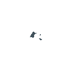

| **Icon** | **Skill Name** | **Animation Internal Name** | **0** | **1** | **2** | **3** | **4** | **5** | **6** | **7** | **8** | **9** | **10** | **11** | **12** | **13** | **14** | **15** | **16** | **17** | **18** | **19** | **20** | **21** | **22** | **23** | **24** | **25** | **26** | **27** | **28** | **29** | **30** | **31** |
|:---:|:---:|:---:|:---:|:---:|:---:|:---:|:---:|:---:|:---:|:---:|:---:|:---:|:---:|:---:|:---:|:---:|:---:|:---:|:---:|:---:|:---:|:---:|:---:|:---:|:---:|:---:|:---:|:---:|:---:|:---:|:---:|:---:|:---:|:---:|
|  | Jump Kick | AirAttack | sprites/stickman14.png  | sprites/stickman14.png  | sprites/stickman14.png  | sprites/stickman14.png  | sprites/stickman15.png  | sprites/stickman15.png  | sprites/stickman15.png  | sprites/stickman15.png  | sprites/stickman15.png  | sprites/stickman15.png  | sprites/stickman15.png  | sprites/stickman16.png  |  |  |
|  | AirFireball | AirFireball | sprites/stickman26.png  | sprites/stickman26.png  | sprites/stickman26.png  | sprites/stickman26.png  | sprites/stickman26.png  | sprites/stickman26.png  | sprites/stickman26.png  | sprites/stickman26.png  | sprites/stickman26.png  | sprites/stickman26.png  | sprites/stickman26.png  | sprites/stickman26.png  | sprites/stickman28.png  |  |
|  | AirUpwardPunch | AirUpwardPunch | sprites/stickman39.png  | sprites/stickman39.png  | sprites/stickman39.png  | sprites/stickman39.png  | sprites/stickman40.png  | sprites/stickman40.png  | sprites/stickman41.png  |  |  |  |  |  |  |  |  |
|  | Burst | Burst | sprites/stickman29.png   |  |  |  |  |  |  |  |  |  |  |  |  |  |
|  | DashBackward | DashBackward | sprites/stickman3.png  |  |  |  |  |  |  |  |  |  |  |  |  |  |
|  | DashForward | DashForward | sprites/stickman2.png  |  |  |  |  |  |  |  |  |  |  |  |  |  |
|  | DiveKick | DiveKick | sprites/stickman51.png  | sprites/stickman51.png  | sprites/stickman51.png  | sprites/stickman51.png  | sprites/stickman51.png  | sprites/stickman51.png  | sprites/stickman51.png  | sprites/stickman51.png  | sprites/stickman51.png  | sprites/stickman51.png  | sprites/stickman51.png  | sprites/stickman42.png  |  |  |
|  | DoubleJump | DoubleJump | sprites/stickman5.png  | sprites/stickman6.png  | sprites/stickman7.png  | sprites/stickman8.png  |  |  |  |  |  |  |  |  |  |  |  |
|  | DropKick | DropKick | sprites/stickman44.png  | sprites/stickman44.png  | sprites/stickman44.png  | sprites/stickman44.png  | sprites/stickman44.png  | sprites/stickman44.png  | sprites/stickman44.png  | sprites/stickman44.png  | sprites/stickman44.png  | sprites/stickman44.png  | sprites/stickman44.png  | sprites/stickman44.png  | sprites/stickman44.png  | sprites/stickman45.png  |
|  | Fireball | Fireball | sprites/stickman26.png  | sprites/stickman26.png  | sprites/stickman26.png  | sprites/stickman26.png  | sprites/stickman26.png  | sprites/stickman26.png  | sprites/stickman26.png  | sprites/stickman26.png  | sprites/stickman26.png  | sprites/stickman26.png  | sprites/stickman26.png  | sprites/stickman26.png  | sprites/stickman27.png  |  |
|  | ForwardThrow | ForwardThrow | sprites/stickman59.png  | sprites/stickman59.png  | sprites/stickman59.png  | sprites/stickman59.png  | sprites/stickman59.png  | sprites/stickman59.png  | sprites/stickman59.png  | sprites/stickman59.png  | sprites/stickman59.png  | sprites/stickman60.png  |  |  |  |  |
|  | Getup | Getup | sprites/stickman37.png  |  |  |  |  |  |  |  |  |  |  |  |  |  |
|  | Grab | Grab | sprites/stickman57.png  | sprites/stickman57.png  | sprites/stickman57.png  | sprites/stickman57.png  | sprites/stickman58.png  | sprites/stickman58.png  | sprites/stickman58.png  | sprites/stickman58.png  | sprites/stickman58.png  | sprites/stickman58.png  | sprites/stickman58.png  | sprites/stickman58.png  | sprites/stickman58.png  |  |
| -- | Grabbed | Grabbed | sprites/stickman5.png  |  |  |  |  |  |  |  |  |  |  |  |  |  |
|  | GroundedKick | GroundedKick | sprites/stickman34.png  | sprites/stickman34.png  |sprites/stickman34.png  | sprites/stickman34.png  | sprites/stickman35.png  | sprites/stickman35.png  | sprites/stickman35.png  | sprites/stickman36.png  |  |  |  |  |  |  |  |
|  | GroundedPunch | GroundedPunch | sprites/stickman11.png  | sprites/stickman11.png  | sprites/stickman12.png  | sprites/stickman12.png  | sprites/stickman13.png  |  |  |  |  |  |  |  |  |  |  |
|  | GroundedSweep | GroundedSweep | sprites/stickman46.png  | sprites/stickman46.png  |sprites/stickman46.png  |  sprites/stickman46.png |sprites/stickman47.png   | sprites/stickman47.png  |  sprites/stickman47.png | sprites/stickman48.png  | sprites/stickman48.png  |  sprites/stickman49.png | sprites/stickman49.png  | sprites/stickman49.png  | sprites/stickman49.png  | sprites/stickman49.png  | sprites/stickman50.png 
|  | HurtAerial | HurtAerial | sprites/stickman17.png  |  |  |  |  |  |  |  |  |  |  |  |  |  |
|  | HurtGroundedHigh | HurtGroundedHigh | sprites/stickman17.png  |  |  |  |  |  |  |  |  |  |  |  |  |  |
|  | HurtGroundedLow | HurtGroundedLow | sprites/stickman17.png  |  |  |  |  |  |  |  |  |  |  |  |  |  |
|  | HurtGroundedMid | HurtGroundedMid | sprites/stickman17.png  |  |  |  |  |  |  |  |  |  |  |  |  |  |
|  | InstantCancel | InstantCancel | sprites/stickman38.png  |  |  |  |  |  |  |  |  |  |  |  |  |  |
|  | Jump | Jump | sprites/stickman4.png  |  |  |  |  |  |  |  |  |  |  |  |  |  |
|  | JumpBack | JumpBack | sprites/stickman5.png  | sprites/stickman8.png  | sprites/stickman7.png  | sprites/stickman6.png  |  |  |  |  |  |  |  |  |  |  |
|  | Jump Kick | JumpKick | sprites/stickman52.png  | sprites/stickman52.png  | sprites/stickman53.png  | sprites/stickman53.png  | sprites/stickman53.png  | sprites/stickman53.png  | sprites/stickman53.png  | sprites/stickman53.png  | sprites/stickman54.png  | sprites/stickman54.png  | sprites/stickman55.png  | sprites/stickman55.png  | sprites/stickman55.png  | sprites/stickman55.png  | sprites/stickman55.png  | sprites/stickman55.png  | sprites/stickman55.png  | sprites/stickman55.png  | sprites/stickman56.png  |
|  | Knockdown | Knockdown | sprites/stickman30.png  |  |  |  |  |  |  |  |  |  |  |  |  |  |
| -- | -- | Landing | sprites/stickman24.png  |  |  |  |  |  |  |  |  |  |  |  |  |  |
|  | Chuk Heavy | NunChukHeavy | sprites/nunchuk_heavy1.png  | sprites/nunchuk_heavy1.png  | sprites/nunchuk_heavy1.png  | sprites/nunchuk_heavy1.png  | sprites/nunchuk_heavy1.png  | sprites/nunchuk_heavy1.png  | sprites/nunchuk_heavy1.png  | sprites/nunchuk_heavy1.png  | sprites/nunchuk_heavy2.png  | sprites/nunchuk_heavy2.png  | sprites/nunchuk_heavy2.png  | sprites/nunchuk_heavy2.png  | sprites/nunchuk_heavy2.png  | sprites/nunchuk_heavy2.png  | sprites/nunchuk_heavy2.png  | sprites/nunchuk_heavy2.png  | sprites/nunchuk_heavy2.png  | sprites/nunchuk_heavy4.png  | 
|  | Chuk Jump | NunChukJump | sprites/chuk_jump1.png  | sprites/chuk_jump1.png  | sprites/chuk_jump1.png  | sprites/chuk_jump1.png  | sprites/chuk_jump1.png  | sprites/chuk_jump1.png  | sprites/chuk_jump1.png  | sprites/chuk_jump1.png  | sprites/chuk_jump1.png  | sprites/chuk_jump1.png  | sprites/chuk_jump1.png  | sprites/chuk_jump1.png  | sprites/chuk_jump1.png  | sprites/chuk_jump1.png  | sprites/chuk_jump1.png  | sprites/chuk_jump2.png  | sprites/chuk_jump2.png  | sprites/chuk_jump2.png  | sprites/chuk_jump2.png  | sprites/chuk_jump3.png  
|  | NunChuk | NunChukLight | sprites/nunchuk_light1.png  | sprites/nunchuk_light1.png  | sprites/nunchuk_light1.png  | sprites/nunchuk_light1.png  | sprites/nunchuk_light1.png  | sprites/nunchuk_light2.png  |sprites/nunchuk_light2.png  |sprites/nunchuk_light2.png  |sprites/nunchuk_light3.png 
|  | Chuk Spin | NunChukSpin | sprites/chuk_spin1.png  |sprites/chuk_spin1.png  |sprites/chuk_spin1.png  |sprites/chuk_spin2.png  |sprites/chuk_spin2.png  |sprites/chuk_spin3.png  |sprites/chuk_spin3.png  |sprites/chuk_spin3.png  |sprites/chuk_spin3.png  |sprites/chuk_spin4.png  |sprites/chuk_spin4.png  |sprites/chuk_spin4.png  |sprites/chuk_spin5.png  |sprites/chuk_spin5.png  |sprites/chuk_spin5.png  |sprites/chuk_spin5.png  |sprites/chuk_spin6.png  |sprites/chuk_spin6.png  |sprites/chuk_spin6.png  |sprites/chuk_spin3.png  |sprites/chuk_spin3.png  |sprites/chuk_spin3.png  |sprites/chuk_spin4.png |sprites/chuk_spin4.png |sprites/chuk_spin4.png |sprites/chuk_spin4.png |sprites/chuk_spin7.png |sprites/chuk_spin7.png |sprites/chuk_spin7.png |sprites/chuk_spin7.png 
|  | ParryHigh | ParryHigh | sprites/stickman32.png  |  |  |  |  |  |  |  |  |  |  |  |  |  |
|  | ParryLow | ParryLow | sprites/stickman33.png  |  |  |  |  |  |  |  |  |  |  |  |  |  |
|  | QuickSlash | QuickSlash  |sprites/phantomdash1.png  |sprites/phantomdash1.png  |sprites/phantomdash1.png  |sprites/phantomdash1.png  |sprites/phantomdash2.png  |sprites/phantomdash3.png  |
|  | RollBackward | RollBackward | sprites/stickman8.png  | sprites/stickman7.png  | sprites/stickman6.png  | sprites/stickman5.png  |  |  |  |  |  |  |  |  |  |  |
|  | RollForward | RollForward | sprites/stickman5.png  | sprites/stickman6.png  | sprites/stickman7.png  | sprites/stickman8.png  |  |  |  |  |  |  |  |  |  |  |
| -- | ThrowTech | ThrowTech | sprites/stickman61.png  |  |  |  |  |  |  |  |  |  |  |  |  |  |
|  | Uppercut | Uppercut | sprites/stickman19.png  | sprites/stickman19.png  | sprites/stickman20.png  | sprites/stickman20.png  | sprites/stickman21.png  | sprites/stickman21.png  | sprites/stickman21.png  | sprites/stickman21.png  | sprites/stickman22.png  | sprites/stickman23.png  |
|  | Wait | Wait | sprites/idle.png  |  |  |  |  |  |  |  |  |  |  |  |  |  |
